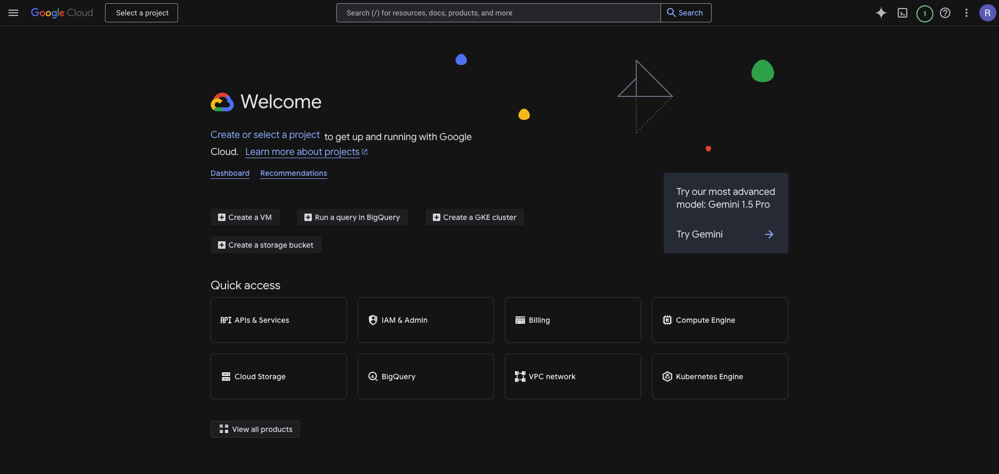

    
    <h1>google-cloud-dark-theme</h1>
    
    

 

# Google Cloud Dark Theme

**Unofficial Google Cloud Platform (GCP) Chrome Extension for Dark Mode**

The **Google Cloud Dark Theme** Chrome extension brings dark mode to the
Google Cloud Console. While an official dark theme has
[long been anticipated](https://issuetracker.google.com/issues/122323757),
it is yet to be introduced. This extension leverages existing CSS classes and
makes minor adjustments to HTML attributes to enable a functional dark theme
for the GCP Console. The goal is to support Dark Mode in GCP with this extension
until the official release of Dark Mode for GCP.

Although this extension doesn't provide complete dark theme support (e.g.,
some assets like images remain unchanged), it covers approximately 95% of
the console, delivering a visually pleasing dark mode experience for most users.

## Features

- Enables a dark theme for the majority of the GCP Console interface.
- Improves usability during extended sessions or in low-light environments.
- Easy-to-install and lightweight extension.

## Contribution

Contributions are welcome! If you'd like to enhance compatibility, fix bugs,
or suggest improvements, feel free to submit a pull request or raise an issue.

> **_NOTE:_** This extension's functionality depends on the current
> implementation of CSS classes in the Google Cloud Console. If the GCP team
> updates or changes these classes, the extension may no longer work as intended.

The google-cloud-dark-theme is not affiliated, associated, authorized, endorsed by,
or in any way officially connected with Google, Google Cloud or any of it's subsidiaries.
